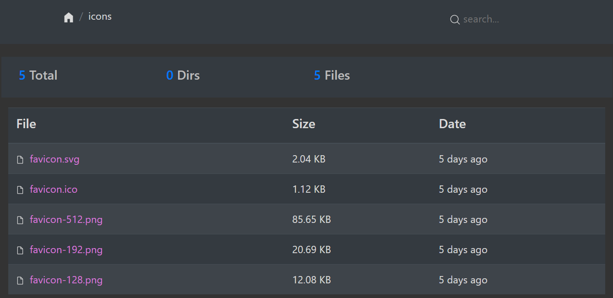
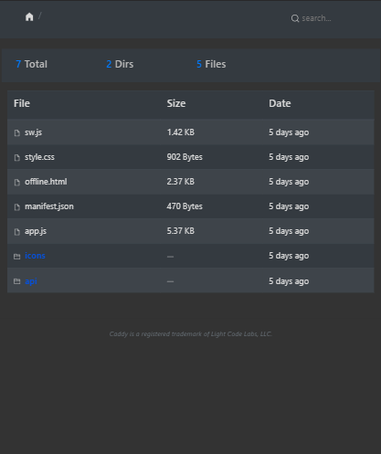
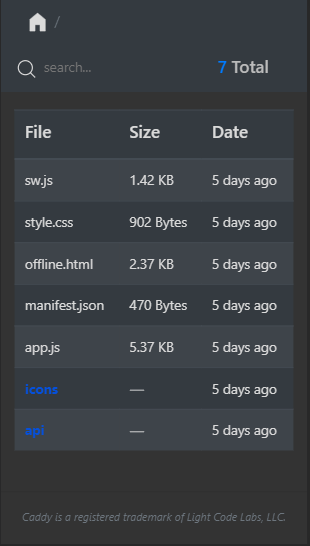
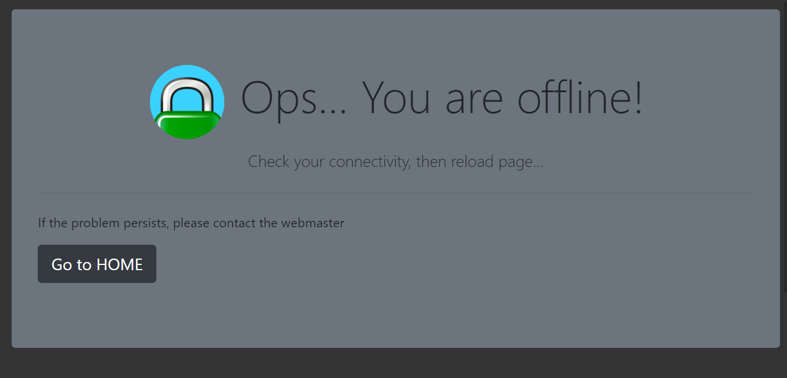
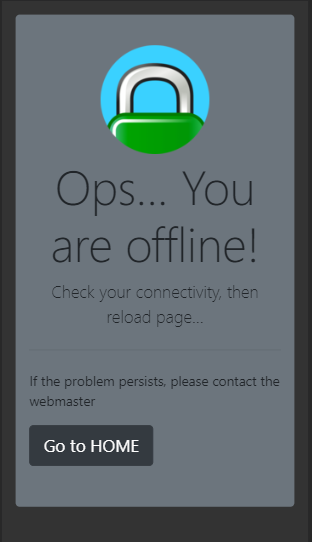

# Caddy Browse Template

Dark theme template for browse directory of [caddy](https://github.com/caddyserver/caddy) web serves, built with
 bootstrap 4 and icons from [Bytesize Icons](https://github.com/danklammer/bytesize-icons).

Progressive Web App compliant. Compatible with caddy v1, see ``Caddyfile.*`` files for example usage.

## ScreenShots

### LICENSE

Apache License 2.0

Caddy is a registered trademark of Light Code Labs, LLC.

